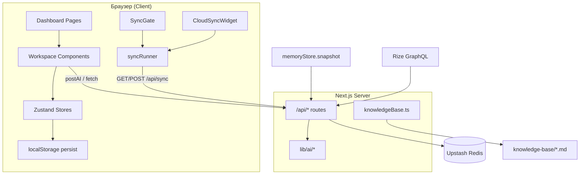

# PROJECT_CONTEXT.md

> **Главный источник контекста проекта My Daily Path.**  
> Перед выполнением любой задачи сначала обращайся к этому документу.  
> При изменениях в коде обновляй соответствующие разделы.  
> **После изменений в коде всегда деплой на Vercel production** (см. [§12.5](#125-deployment) и [§13](#13-правила-поддержки-документа)).

**Последнее обновление:** 2026-07-08

---

## Оглавление

1. [Общая архитектура](#1-общая-архитектура)
2. [Страницы сайта](#2-страницы-сайта)
3. [Формы](#3-формы)
4. [Бизнес-логика](#4-бизнес-логика)
5. [Backend (серверная часть)](#5-backend-серверная-часть)
6. [Хранение данных (БД)](#6-хранение-данных-бд)
7. [API](#7-api)
8. [Компоненты](#8-компоненты)
9. [Основные функции и модули](#9-основные-функции-и-модули)
10. [Потоки данных](#10-потоки-данных)
11. [Авторизация и права доступа](#11-авторизация-и-права-доступа)
12. [Настройки проекта](#12-настройки-проекта)
13. [Правила поддержки документа](#13-правила-поддержки-документа)
14. [Технический аудит (2026-07-08)](#14-технический-аудит-2026-07-08)

---

## 1. Общая архитектура

### 1.1 Назначение проекта

**My Daily Path** — личный AI-ассистент для жизни, обучения и карьеры. Одно веб-приложение объединяет:

- умное расписание дня (AI-планировщик + календарь);
- аналитику прогресса и AI-отчёты;
- ежедневное изучение английского (English Boost);
- готовку по продуктам из холодильника;
- карьерный блок (CV, вакансии, заявки, LinkedIn);
- статическую базу знаний по ML и аналитике.

Приложение **local-first**: основные данные живут в браузере (`localStorage` через Zustand persist). Опционально синхронизируются между устройствами (телефон ↔ ПК) через сервер и Upstash Redis. AI-запросы выполняются **только на сервере** (Next.js API Routes).

### 1.2 Технологический стек

| Слой | Технологии |
|------|------------|
| Framework | [Next.js 15](package.json) (App Router), React 19, TypeScript |
| Стили | Tailwind CSS, [globals.css](src/app/globals.css) |
| UI | shadcn-подобные компоненты ([button](src/components/ui/button.tsx), [card](src/components/ui/card.tsx)), Lucide icons |
| Состояние | [Zustand 5](src/stores/) + `persist` middleware |
| Календарь | FullCalendar 6 ([CalendarView](src/components/schedule/CalendarView.tsx)) |
| Markdown | react-markdown, remark-gfm, remark-math, rehype-katex |
| AI | Мульти-провайдер ([provider.ts](src/lib/ai/provider.ts)), Zod-схемы ([schemas.ts](src/lib/ai/schemas.ts)) |
| Cloud sync | Upstash Redis ([serverStore.ts](src/lib/sync/serverStore.ts)) |
| Интеграции | Rize (GraphQL), LinkedIn OAuth (скелет) |
| Тесты | Vitest ([vitest.config.ts](vitest.config.ts)) |
| Деплой | Vercel ([vercel.json](vercel.json)) |

> **Важно:** README упоминает Dexie/IndexedDB, но в текущем коде **Dexie не используется**. Персистентность — Zustand + localStorage + опциональный Redis.

### 1.3 Структура проекта

```
my-daily-path/
├── knowledge-base/          # Markdown-статьи (файловая «БД» знаний)
├── public/                  # Статика (иконки, kb-img SVG)
├── scripts/                 # PowerShell/Node утилиты (dev, sync restore, Windows app)
├── src/
│   ├── app/                 # Next.js App Router: страницы + API
│   │   ├── (dashboard)/     # Layout с sidebar + 7 разделов
│   │   ├── api/             # Серверные маршруты (AI, sync, Rize, LinkedIn)
│   │   ├── layout.tsx       # Root layout, тема
│   │   └── page.tsx         # Redirect → /schedule
│   ├── components/          # React-компоненты по доменам
│   ├── config/              # nav.ts — навигация
│   ├── hooks/               # useMounted и др.
│   ├── lib/                 # Бизнес-логика, AI, sync, интеграции
│   ├── stores/              # Zustand stores
│   └── types/               # Доменные TypeScript-типы
├── .env.example             # Шаблон переменных окружения
├── next.config.mjs
├── package.json
└── PROJECT_CONTEXT.md       # ← этот файл
```

### 1.4 Основные директории

| Директория | Назначение |
|------------|------------|
| [src/app/(dashboard)/](src/app/(dashboard)/) | Страницы приложения с общим layout |
| [src/app/api/](src/app/api/) | Серверные API (AI, sync, интеграции) |
| [src/components/](src/components/) | UI по доменам: layout, schedule, english, progress, career, cooking, knowledge |
| [src/stores/](src/stores/) | Клиентское состояние + persist |
| [src/lib/ai/](src/lib/ai/) | AI-провайдер, промты, схемы, fallback |
| [src/lib/sync/](src/lib/sync/) | Cloud sync (client, server, merge, auth) |
| [src/lib/integrations/](src/lib/integrations/) | Rize API |
| [src/types/index.ts](src/types/index.ts) | Единые доменные типы |
| [knowledge-base/](knowledge-base/) | Markdown-контент для раздела Knowledge |

### 1.5 Взаимосвязь компонентов



**Boot-последовательность:**

1. [Root layout](src/app/layout.tsx) — ThemeProvider (next-themes).
2. [Dashboard layout](src/app/(dashboard)/layout.tsx) — SwipeArea → SyncGate → Sidebar + main.
3. [SyncGate](src/components/layout/SyncGate.tsx) — data protection check → cloud sync (если включён) → рендер children.
4. Страницы читают/пишут Zustand stores; изменения debounce-push в облако (600 ms).

---

## 2. Страницы сайта

Навигация определена в [src/config/nav.ts](src/config/nav.ts).

| Раздел | URL | Файл страницы |
|--------|-----|---------------|
| Home | `/` → redirect `/schedule` | [src/app/page.tsx](src/app/page.tsx) |
| Schedule | `/schedule` | [src/app/(dashboard)/schedule/page.tsx](src/app/(dashboard)/schedule/page.tsx) |
| Calendar | `/calendar` | [src/app/(dashboard)/calendar/page.tsx](src/app/(dashboard)/calendar/page.tsx) |
| Progress | `/progress` | [src/app/(dashboard)/progress/page.tsx](src/app/(dashboard)/progress/page.tsx) |
| Daily English | `/english` | [src/app/(dashboard)/english/page.tsx](src/app/(dashboard)/english/page.tsx) |
| Cooking | `/cooking` | [src/app/(dashboard)/cooking/page.tsx](src/app/(dashboard)/cooking/page.tsx) |
| Work / Career | `/career` | [src/app/(dashboard)/career/page.tsx](src/app/(dashboard)/career/page.tsx) |
| Knowledge | `/knowledge` | [src/app/(dashboard)/knowledge/page.tsx](src/app/(dashboard)/knowledge/page.tsx) |
| Knowledge article | `/knowledge/[slug]` | [src/app/(dashboard)/knowledge/[slug]/page.tsx](src/app/(dashboard)/knowledge/[slug]/page.tsx) |

Все dashboard-страницы оборачивают контент в [PageShell](src/components/layout/PageShell.tsx).

---

### 2.1 `/` — Home

- **Назначение:** точка входа.
- **Действие:** server redirect на `/schedule`.
- **Данные:** нет.
- **Состояния:** нет UI.

---

### 2.2 `/schedule` — Schedule (AI day planner)

- **Компонент:** [ScheduleWorkspace](src/components/schedule/ScheduleWorkspace.tsx)
- **Stores:** [scheduleStore](src/stores/scheduleStore.ts), [memoryStore](src/stores/memoryStore.ts) (через AI)

**Отображаемые данные:**
- События выбранного дня (agenda).
- Постоянные привычки (habits) с развёрнутыми occurrence.
- Баннер data protection (число auto-locked записей).
- Результат последнего AI-планирования (summary, provider).

**Ввод пользователя:**
- Текстовая инструкция для AI-планировщика ([NaturalInput](src/components/schedule/NaturalInput.tsx)).
- Inline-редактирование событий (title, start/end, category).
- CRUD привычек (ручной + AI).

**Действия:**
- AI-планирование дня → `POST /api/ai/plan`.
- Undo последнего изменения расписания (store + фразы «undo»/«отмени»).
- Цикл статуса события: planned → done → skipped.
- Unlock locked событий.
- AI-генерация привычек → `POST /api/ai/habits`.
- Ручное добавление/редактирование/удаление событий и привычек.

**Источники данных:** `scheduleStore.events`, `scheduleStore.habits`; memory snapshot уходит в AI.

**API:** `/api/ai/plan`, `/api/ai/habits`.

**Проверки:**
- Пустая инструкция не отправляется.
- Locked записи блокируют редактирование (нужен unlock).
- [planSafety](src/lib/planSafety.ts) — preview перед apply; прошлые даты отбрасываются.
- [parseTimedPlan](src/lib/parseTimedPlan.ts) — локальный парсер `HH:MM–HH:MM` без AI.

**Состояния UI:**
- `usePlanner`: `loading`, `error`, `last` (PlannerResult).
- Undo доступен через store (`past` history, max 30 шагов).

---

### 2.3 `/calendar` — Calendar

- **Компоненты:** [RizeSyncBar](src/components/schedule/RizeSyncBar.tsx), [CalendarViewLoader](src/components/schedule/CalendarViewLoader.tsx) → [CalendarView](src/components/schedule/CalendarView.tsx)
- **Store:** [scheduleStore](src/stores/scheduleStore.ts)

**Отображаемые данные:**
- FullCalendar: month / week / day / list.
- События + recurring habit blocks (пунктир).
- Rize sync status bar.

**Ввод:**
- Drag & drop / resize событий.
- Modal редактирования (title, times, category, status, notes).
- Prompt при клике на пустой слот (новое событие).

**Действия:**
- Sync Rize focus time (336h lookback по умолчанию).
- CRUD событий через modal.
- Habits — только просмотр (read-only в календаре).

**API:** `GET/POST /api/integrations/rize/sync` (через [rizeSyncClient.ts](src/lib/integrations/rizeSyncClient.ts)).

**Проверки:** locked events требуют unlock перед edit/delete.

**Состояния RizeSyncBar:** `idle` → `syncing` → `success` / `error` (сообщение через `formatRizeSyncMessage`).

---

### 2.4 `/progress` — Progress

- **Компонент:** [ProgressWorkspace](src/components/progress/ProgressWorkspace.tsx) (dynamic import, SSR off)
- **Stores:** [progressStore](src/stores/progressStore.ts), [scheduleStore](src/stores/scheduleStore.ts), [careerStore](src/stores/careerStore.ts), [memoryStore](src/stores/memoryStore.ts)

**Отображаемые данные:**
- Долгосрочная цель + ML hours ([GoalCard](src/components/progress/GoalCard.tsx)).
- 7-day overview, charts ([ProgressCharts](src/components/progress/ProgressCharts.tsx)).
- Daily reflection logs ([TodayNoteCard](src/components/progress/TodayNoteCard.tsx)).
- AI daily/weekly reports ([ProgressAIInsights](src/components/progress/ProgressAIInsights.tsx)).
- Export card.

**Ввод:** текстовые заметки дня; кнопки генерации AI-отчётов.

**Действия:**
- CRUD daily logs (add/update/delete/unlock/undo).
- Generate daily report → `POST /api/ai/progress`.
- Generate weekly report → `POST /api/ai/progress/weekly`.
- Export JSON / Markdown journal.

**Источники:** `progressStore`, analytics из `scheduleStore.events` ([progressAnalytics.ts](src/lib/progressAnalytics.ts)), `careerStore.applications`, `memoryStore`.

**Состояния AI insights:** loading, error, saved report in store.

---

### 2.5 `/english` — Daily English (English Boost)

- **Компонент:** [EnglishWorkspace](src/components/english/EnglishWorkspace.tsx)
- **Store:** [englishStore](src/stores/englishStore.ts)

**Фазы сессии** (`EnglishSessionPhase`):
`select` → `flashcards` → `quiz` → `review` → `complete`

**Отображаемые данные:**
- Settings, stats bar, vocabulary drop pool.
- Flashcards, quiz, final review panels.
- History (7 days).

**Ввод:**
- Settings (words/day, pool size, level, categories).
- Выбор N слов из AI-drop.
- User examples на flashcards.
- Quiz answers, final review typed answers.

**Действия:**
- AI vocab drop → `POST /api/ai/english-vocab`.
- Полный daily session flow через store actions.
- Reset session for tomorrow.
- History backfill on mount.

**API:** `/api/ai/english-vocab`.

**Проверки:**
- Ровно `dailyWordCount` слов при confirm selection.
- SRS через [englishSrs.ts](src/lib/englishSrs.ts).
- Stale session expiry.

---

### 2.6 `/cooking` — Cooking

- **Компонент:** [CookingWorkspace](src/components/cooking/CookingWorkspace.tsx)
- **Stores:** [cookingStore](src/stores/cookingStore.ts), [memoryStore](src/stores/memoryStore.ts)

**Отображаемые данные:** fridge items, AI recipe suggestions, saved recipes (max 50).

**Ввод:** NL команды для холодильника; recipe request; manual item name/qty.

**Действия:**
- AI fridge command → `POST /api/ai/fridge-command` → `applyFridgeCommand`.
- AI recipes → `POST /api/ai/recipes`.
- Save/favorite/delete recipes; manual fridge CRUD.

---

### 2.7 `/career` — Work / Career

- **Компонент:** [CareerWorkspace](src/components/career/CareerWorkspace.tsx)
- **Stores:** [careerStore](src/stores/careerStore.ts), [memoryStore](src/stores/memoryStore.ts)

**Подразделы:**
- [CVManager](src/components/career/CVManager.tsx) — версии CV (Markdown + file upload).
- [JobSearch](src/components/career/JobSearch.tsx) — AI job search.
- [ApplicationsList](src/components/career/ApplicationsList.tsx) — pipeline заявок.
- [LinkedInSection](src/components/career/LinkedInSection.tsx) — OAuth + post ideas.

**API:** `/api/ai/jobs`, `/api/ai/application`, `/api/ai/post`, `/api/auth/linkedin`.

**OAuth callback:** query params `?linkedin=connected|notconfigured` на `/career`.

---

### 2.8 `/knowledge` — Knowledge Base Index

- **Тип:** Server Component (без client stores).
- **Loader:** [knowledgeBase.ts](src/lib/knowledgeBase.ts)

**Отображаемые данные:**
- Карточки статей из `knowledge-base/**/*.md`.
- Planned sections (ссылки на Notion).

**Действия:** навигация на `/knowledge/[slug]`, внешние Notion links.

**Источник:** файловая система сервера (`knowledge-base/`).

---

### 2.9 `/knowledge/[slug]` — Knowledge Article

- **Тип:** Server Component + `generateStaticParams`.
- **Рендер:** [KnowledgeMarkdown](src/components/knowledge/KnowledgeMarkdown.tsx) (GFM + KaTeX + heading slugs).

**Данные:** frontmatter (title, section, tags, source) + body markdown.

**Действия:** чтение, back link, optional Notion source link.

---

## 3. Формы

Приложение **не использует** `<form>`, react-hook-form или client-side Zod. Все формы — controlled inputs + handlers. Серверная Zod-валидация — в AI routes.

### 3.1 Schedule

| Форма | Поля | Обязательность | Валидация | Submit | API | Ошибки |
|-------|------|----------------|-----------|--------|-----|--------|
| NaturalInput | textarea (instruction) | да (trim) | Ctrl+Enter | `usePlanner.run()` | POST `/api/ai/plan` | empty, AI 502, «Nothing was changed» |
| HabitsManager AI | textarea, checkbox replace | да | non-empty | add/set habits | POST `/api/ai/habits` | 400 empty, 502 |
| HabitsManager manual | title, weekdays[], time, duration, category | title + ≥1 weekday | inline | `addHabit()` | — | — |
| Agenda EventRow | title, start, end, category | — | locked block | live `updateEvent` | — | locked |
| Calendar EditModal | title, start, end, category, status, notes | — | locked → unlock | update/delete | — | locked |

### 3.2 English

| Форма | Поля | Обязательность | Submit | API |
|-------|------|----------------|--------|-----|
| SettingsPanel | dailyWordCount 5–15, dropPoolSize 15–30, level, categories | ≥1 category | `updateSettings()` | — |
| VocabularyDrop | word card toggles | ровно N слов | `confirmSelection()` | POST `/api/ai/english-vocab` |
| FlashcardPanel | user example (optional) | — | `setUserExample()` | — |
| QuizPanel | MC / matching | answer before next | `answerQuiz()` | — |
| FinalReviewPanel | text per word | non-empty to check | `submitFinalReview()` | — |

### 3.3 Progress

| Форма | Поля | Submit | API |
|-------|------|--------|-----|
| TodayNoteCard | note textarea | `addLog` / `updateLog` (Ctrl+Enter) | — |
| ProgressAIInsights | buttons | generate report | POST `/api/ai/progress`, `/api/ai/progress/weekly` |
| ExportDataCard | buttons | client download | — |

### 3.4 Career

| Форма | Поля | Валидация | Submit | API |
|-------|------|-----------|--------|-----|
| CVManager | label, targetRole, markdown; file upload | PDF ≤4 MB | add/update CV | — |
| JobSearch | query input | Enter/button | search jobs | POST `/api/ai/jobs` |
| ApplicationDialog | CV select, cover letter | CV required | generate/save | POST `/api/ai/application` |
| ApplicationsList | status select | — | `setApplicationStatus` | — |
| LinkedInSection | context, draft, remind date, posted | — | post ideas | POST `/api/ai/post`, GET `/api/auth/linkedin` |

### 3.5 Cooking

| Форма | Поля | Submit | API |
|-------|------|--------|-----|
| FridgeCard AI | NL textarea | `applyFridgeCommand` | POST `/api/ai/fridge-command` |
| FridgeCard manual | item name | `addItem` | — |
| Fridge list | name, qty inline | live `updateItem` | — |
| SuggestionsCard | request textarea | fetch recipes | POST `/api/ai/recipes` |

### 3.6 Sync

| Форма | Поля | Валидация | Submit |
|-------|------|-----------|--------|
| SyncKeySetup | password (sync code) | min 8 chars | `verifySyncKey` → `enableSync` → `pullFromCloud` |

---

## 4. Бизнес-логика

### 4.1 Основные процессы

1. **AI-планирование дня** — NL instruction → plan API → merge events в schedule → optional memory updates.
2. **Календарь + привычки** — habits expand в occurrences ([habits.ts](src/lib/habits.ts)); events editable в agenda/calendar.
3. **Rize sync** — import focus blocks → replace in lookback window → preserve user-edited locked entries.
4. **Data protection** — записи без изменений 2+ дня → `locked: true` + archive в `mdp-permanent-archive`.
5. **Cloud sync** — bidirectional merge blobs (smart merge для schedule/english).
6. **English daily session** — AI vocab → select → flashcards → quiz (SRS) → final review → score + history.
7. **Progress analytics** — done learning events → hours, streaks, charts, AI context.
8. **Career pipeline** — CV versions → AI jobs → application (adapted CV + cover letter) → status tracking.

### 4.2 Последовательность типичного пользователя

```
Утро: Schedule → AI plan → Calendar review
       ↓
День: Calendar edits / Rize sync / mark events done
       ↓
English: daily session (10 words)
       ↓
Вечер: Progress → daily note → AI daily report
       ↓
Опционально: Cooking / Career / Knowledge reading
```

### 4.3 Правила системы

| Правило | Реализация |
|---------|------------|
| Auto-lock через 2 дня | [dataProtection.ts](src/lib/dataProtection.ts), `LOCK_AFTER_MS` |
| Locked records immutable без unlock | stores + UI guards |
| Undo schedule (30 steps) | `scheduleStore.past` (не persist) |
| Undo logs | `progressStore.logsPast` |
| Recipes max 50 | `cookingStore` |
| English session phases linear | `englishStore.activeSession.phase` |
| Rize: skip synthetic IDs | [rize.ts](src/lib/integrations/rize.ts) |
| Rize: keep user-edited locked | `replaceRizeEvents` skip logic |
| AI offline fallback | все AI routes работают без API key |
| Plan: skip past dates | [planSafety.ts](src/lib/planSafety.ts) |

### 4.4 Ограничения

- Нет multi-user auth — приложение для одного пользователя.
- localStorage limits (~5 MB) — большие CV files как data URL.
- Cloud sync требует Redis + SYNC_SECRET на Vercel.
- LinkedIn OAuth — redirect scaffold, token exchange не реализован.
- Knowledge base — read-only markdown, не редактируется в UI.

### 4.5 Зависимости между разделами

| От | К | Связь |
|----|---|-------|
| Schedule (done learning events) | Progress | hours, streaks, charts |
| Schedule | Progress AI | calendarSessions context |
| Memory | Все AI endpoints | goals, pace, preferences |
| Career applications | Progress AI | applicationsByStatus |
| English history | Cloud sync diagnostics | stats merge |
| Rize sync | Schedule + Cloud sync | replaceRizeEvents → push |

---

## 5. Backend (серверная часть)

Next.js **App Router API Routes** (`src/app/api/**/route.ts`). Все AI/sync routes: `export const runtime = "nodejs"`.

### 5.1 Архитектура сервера

```
Request → route.ts (handler)
       → lib/ai/run.ts | provider.ts | schemas.ts
       → lib/sync/serverStore.ts (Redis / local file)
       → lib/integrations/rize.ts (GraphQL)
       → lib/knowledgeBase.ts (fs, server-only)
```

**Нет классических MVC controllers/models** — логика в route handlers + lib modules.

### 5.2 AI Layer

| Модуль | Назначение |
|--------|------------|
| [provider.ts](src/lib/ai/provider.ts) | `chatComplete()` — OpenAI, Anthropic, Grok, Gemini, Groq |
| [run.ts](src/lib/ai/run.ts) | `runStructured()` — JSON extract + Zod parse + fallback |
| [prompts.ts](src/lib/ai/prompts.ts) | System prompts + user message builders |
| [schemas.ts](src/lib/ai/schemas.ts) | Zod schemas для всех AI responses |
| [fallbackPlanner.ts](src/lib/ai/fallbackPlanner.ts) | Offline plan без API key |
| [translatePlan.ts](src/lib/ai/translatePlan.ts) | Cyrillic → English post-process для plan |
| [aiClient.ts](src/lib/aiClient.ts) | Client helper `postAI()` |

**Provider selection:** env `AI_PROVIDER` (default: openai).

### 5.3 Sync Layer

| Модуль | Назначение |
|--------|------------|
| [client.ts](src/lib/sync/client.ts) | SYNC_STORAGE_KEYS, collect/apply blobs |
| [serverStore.ts](src/lib/sync/serverStore.ts) | read/write Redis or `.data/sync-state.json` |
| [syncRunner.ts](src/lib/sync/syncRunner.ts) | Client orchestration: push/pull/runCloudSync |
| [blobUtils.ts](src/lib/sync/blobUtils.ts) | Meaningful blob checks, safe merge |
| [scheduleBlobMerge.ts](src/lib/sync/scheduleBlobMerge.ts) | Field-level schedule merge |
| [englishBlobMerge.ts](src/lib/sync/englishBlobMerge.ts) | Field-level english merge |
| [syncStoreFlush.ts](src/lib/sync/syncStoreFlush.ts) | Flush stores → localStorage before push |
| [syncAuth*.ts](src/lib/sync/) | Header `x-sync-key`, client enable/disable |

### 5.4 Integrations

| Модуль | Назначение |
|--------|------------|
| [rize.ts](src/lib/integrations/rize.ts) | GraphQL client, map entries → calendar events |
| [rizeSyncClient.ts](src/lib/integrations/rizeSyncClient.ts) | Browser-side sync orchestration |

---

## 6. Хранение данных (БД)

**Традиционной SQL/NoSQL БД нет.** Три уровня хранения:

### 6.1 localStorage (клиент, primary)

| Ключ | Store | Содержимое |
|------|-------|------------|
| `mdp-schedule` | scheduleStore | events, habits |
| `mdp-progress` | progressStore | tracks, reports, weeklyReports, logs, goal |
| `mdp-memory` | memoryStore | goals, values, constraints, learningPace, preferences, notes |
| `mdp-cooking` | cookingStore | fridge, recipes |
| `mdp-career` | careerStore | cvs, postings, applications, posts, linkedInConnected |
| `mdp-english` | englishStore | settings, vocabulary, srs, sessions, history, stats |
| `mdp-permanent-archive` | dataProtection | locked scheduleEvents, habits, dailyLogs |
| `mdp-sync-key` | syncAuthClient | sync secret (client) |
| `mdp-sync-enabled` | syncAuthClient | `"true"` / absent |
| `mdp-sync-meta` | syncAuthClient | `{ updatedAt }` |

Формат Zustand persist: `{ state: {...}, version?: number }`.

### 6.2 Upstash Redis (сервер, optional cloud sync)

- **Key:** `mdp:sync-state`
- **Payload:** `{ updatedAt: ISO, blobs: Record<SyncStorageKey, string> }`
- **Env:** `UPSTASH_REDIS_REST_URL`, `UPSTASH_REDIS_REST_TOKEN` (или legacy `KV_*`)
- **Local dev fallback:** `.data/sync-state.json`

### 6.3 Файловая система (knowledge base)

Markdown в [knowledge-base/](knowledge-base/) с YAML frontmatter:

```
title, section, tags, source, imported, updated, status
```

**Текущие статьи (14):** intro, python, pandas, matplotlib, ml, modeling, algorithms, databases, api, airflow, marketing, deployment, interview (2).

### 6.4 Доменные сущности (логические «таблицы»)

Определены в [src/types/index.ts](src/types/index.ts):

| Сущность | Ключевые поля | Store |
|----------|---------------|-------|
| ScheduleEvent | id, title, category, start, end, status, priority, meta.rizeEntryId, locked | schedule |
| Habit | id, title, weekdays, time, duration, category, locked | schedule |
| DailyLog | id, date, text, calendarEventId, locked | progress |
| LearningTrack | id, name, type, loggedHours, streak | progress |
| EnglishVocabWord | id, term, translationRu, definition, example, category | english |
| EnglishWordSRS | wordId, intervalIndex, nextReviewAt, mastered | english |
| FridgeItem | id, name, qty, expiresAt | cooking |
| Recipe | id, title, ingredients, steps, favorite | cooking |
| CVVersion | id, label, markdown, fileDataUrl | career |
| JobApplication | id, company, role, status | career |
| UserMemory | goals, values, constraints, learningPace, notes | memory |

**Связи:**
- DailyLog ↔ ScheduleEvent (optional `calendarEventId`)
- JobApplication ↔ CVVersion (`cvVersionId`)
- EnglishWordSRS ↔ EnglishVocabWord (`wordId`)
- ScheduleEvent ↔ Rize (`meta.rizeEntryId`)

---

## 7. API

Все AI routes (кроме `/api/ai/plan`) возвращают:

```typescript
{
  data: T;
  provider: string;
  usedFallback: boolean;
}
```

### 7.1 AI Routes

#### POST `/api/ai/plan`

- **Файл:** [src/app/api/ai/plan/route.ts](src/app/api/ai/plan/route.ts)
- **Body (Zod):**
  ```typescript
  {
    instruction: string;      // min 1
    now?: string;             // ISO
    timezone?: string;        // default "UTC"
    memory?: Partial<UserMemory>;
    events?: ScheduleEvent[];
    habits?: Habit[];
  }
  ```
- **Response 200:**
  ```typescript
  {
    events: AIEvent[];
    reasoning: string;
    summary: string;
    memoryUpdates: string[];
    provider: string;
    usedFallback: boolean;
  }
  ```
- **Errors:** 400 (invalid JSON/validation), 502 (AI failure)
- **Особенности:** local timed parser first; Cyrillic translation; offline fallbackPlan

#### POST `/api/ai/habits`

- **Body:** `{ instruction: string, existingHabits?: Habit[] }`
- **Response data:** `{ reasoning, mode: "merge"|"replace", habits: AIHabit[] }`
- **Errors:** 400 empty instruction, 502

#### POST `/api/ai/progress`

- **Body:** `{ memory?, tracks?, applicationsByStatus?, recentLearning?, dailyLogs?, calendarSessions? }`
- **Response data:** `{ summary, recommendations, focusMore, focusLess }`

#### POST `/api/ai/progress/weekly`

- **Body:** `{ memory?, goal?, weekLabel?, calendarSessions?, dailyLogs?, learningHoursByDay? }`
- **Response data:** WeeklyProgressReport (summary, highlights, topicsStudied, dynamics, strengths, improvements, nextWeekFocus)

#### POST `/api/ai/english-vocab`

- **Body:** `{ poolSize?: 15-30, level?, focusCategories?, knownTerms? }`
- **Response data:** `{ reasoning, words: EnglishVocabWord[] }`

#### POST `/api/ai/fridge-command`

- **Body:** `{ instruction: string, fridge?: string[] }`
- **Response data:** `{ reasoning, add: {name, qty?}[], remove: string[] }`
- **Errors:** 400 empty instruction

#### POST `/api/ai/recipes`

- **Body:** `{ fridge?: string[], request?: string, memory? }`
- **Response data:** `{ recipes: AIRecipe[] }`

#### POST `/api/ai/jobs`

- **Body:** `{ memory?, cvSummary?: string, query?: string }`
- **Response data:** `{ jobs: AIJobPosting[] }`

#### POST `/api/ai/application`

- **Body:** `{ cvMarkdown?: string, job: { title, company?, description? }, memory? }`
- **Response data:** `{ adaptedCV, coverLetter, tips }`
- **Errors:** 400 no job title

#### POST `/api/ai/post`

- **Body:** `{ memory?, context?: string }`
- **Response data:** `{ ideas: { topic, draft }[] }`

### 7.2 Sync Routes

#### GET `/api/sync`

- **Auth:** header `x-sync-key: <SYNC_SECRET>` (если Redis + SYNC_SECRET configured)
- **Response 200 (no auth):** `{ updatedAt: null, blobs: {}, cloud, optInRequired: true }`
- **Response 401:** `{ error: "Invalid sync code", needsKey: true, ... }`
- **Response 200 (success):** `{ updatedAt, blobs, cloud, optInRequired: false }`

#### POST `/api/sync`

- **Body:** `{ blobs: Record<string, string> }`
- **Errors:** 400 invalid JSON, 401 wrong key, 413 payload too large, 503 no Redis on Vercel
- **Limits:** max 512 KB per blob, max 2 MB total POST body
- **Response 200:** SyncPayload after merge

#### GET `/api/sync/config`

- **Response:** `{ cloud: boolean, authRequired: boolean }`

### 7.3 Integration Routes

#### GET `/api/integrations/rize/sync`

- **Response:** `{ configured: boolean }`

#### POST `/api/integrations/rize/sync`

- **Query:** `lookbackHours` (1–720, default 168), `lookaheadDays` (0–14), `timezone`
- **Errors:** 503 no RIZE_API_KEY, 502 Rize failure
- **Response:** `{ ok, count, stats, window, events: RizeCalendarEvent[] }`

#### GET `/api/auth/linkedin`

- **Behavior:** OAuth redirect scaffold (not JSON)
- No `LINKEDIN_CLIENT_ID` → redirect `/career?linkedin=notconfigured`
- No `code` → redirect to LinkedIn authorize
- With `code` → redirect `/career?linkedin=connected` (no token exchange)

---

## 8. Компоненты

### 8.1 Layout

| Компонент | Файл | Props | Использование |
|-----------|------|-------|---------------|
| PageShell | [PageShell.tsx](src/components/layout/PageShell.tsx) | title, description?, icon?, children | Все dashboard pages |
| DesktopSidebar / MobileDrawer | [Sidebar.tsx](src/components/layout/Sidebar.tsx) | — | Dashboard layout |
| MobileTopbar | [MobileTopbar.tsx](src/components/layout/MobileTopbar.tsx) | — | Dashboard layout |
| SwipeArea | [SwipeArea.tsx](src/components/layout/SwipeArea.tsx) | children | Edge swipe nav |
| SyncGate | [SyncGate.tsx](src/components/layout/SyncGate.tsx) | children | Boot sync + protection |
| CloudSyncWidget | [CloudSyncWidget.tsx](src/components/layout/CloudSyncWidget.tsx) | collapsed? | Sidebar |
| SyncKeySetup | [SyncKeySetup.tsx](src/components/layout/SyncKeySetup.tsx) | onSaved, onCancel? | CloudSyncWidget modal |
| ThemeToggle | [ThemeToggle.tsx](src/components/layout/ThemeToggle.tsx) | — | Sidebar |
| ThemeProvider | [theme-provider.tsx](src/components/theme-provider.tsx) | NextThemes props | Root layout |

### 8.2 Schedule

| Компонент | Файл | Назначение |
|-----------|------|------------|
| ScheduleWorkspace | [ScheduleWorkspace.tsx](src/components/schedule/ScheduleWorkspace.tsx) | Главный workspace |
| NaturalInput | [NaturalInput.tsx](src/components/schedule/NaturalInput.tsx) | AI planner input |
| Agenda | [Agenda.tsx](src/components/schedule/Agenda.tsx) | Day agenda list |
| HabitsManager | [HabitsManager.tsx](src/components/schedule/HabitsManager.tsx) | Habits CRUD + AI |
| CalendarView | [CalendarView.tsx](src/components/schedule/CalendarView.tsx) | FullCalendar |
| CalendarViewLoader | [CalendarViewLoader.tsx](src/components/schedule/CalendarViewLoader.tsx) | Dynamic import wrapper |
| RizeSyncBar | [RizeSyncBar.tsx](src/components/schedule/RizeSyncBar.tsx) | Rize sync UI |
| DataProtectionBanner | [DataProtectionBanner.tsx](src/components/schedule/DataProtectionBanner.tsx) | Lock count banner |
| usePlanner | [usePlanner.ts](src/components/schedule/usePlanner.ts) | Hook: plan API + apply |

### 8.3 English

| Компонент | Файл | Фазы |
|-----------|------|------|
| EnglishWorkspace | [EnglishWorkspace.tsx](src/components/english/EnglishWorkspace.tsx) | all |
| FlashcardPanel | [FlashcardPanel.tsx](src/components/english/FlashcardPanel.tsx) | flashcards |
| QuizPanel | [QuizPanel.tsx](src/components/english/QuizPanel.tsx) | quiz |
| FinalReviewPanel | [FinalReviewPanel.tsx](src/components/english/FinalReviewPanel.tsx) | review |

### 8.4 Progress

| Компонент | Файл |
|-----------|------|
| ProgressWorkspace | [ProgressWorkspace.tsx](src/components/progress/ProgressWorkspace.tsx) |
| GoalCard | [GoalCard.tsx](src/components/progress/GoalCard.tsx) |
| ProgressCharts | [ProgressCharts.tsx](src/components/progress/ProgressCharts.tsx) |
| TodayNoteCard | [TodayNoteCard.tsx](src/components/progress/TodayNoteCard.tsx) |
| ProgressAIInsights | [ProgressAIInsights.tsx](src/components/progress/ProgressAIInsights.tsx) |
| ExportDataCard | [ExportDataCard.tsx](src/components/progress/ExportDataCard.tsx) |

### 8.5 Career

| Компонент | Файл |
|-----------|------|
| CareerWorkspace | [CareerWorkspace.tsx](src/components/career/CareerWorkspace.tsx) |
| CVManager | [CVManager.tsx](src/components/career/CVManager.tsx) |
| JobSearch | [JobSearch.tsx](src/components/career/JobSearch.tsx) |
| ApplicationsList | [ApplicationsList.tsx](src/components/career/ApplicationsList.tsx) |
| LinkedInSection | [LinkedInSection.tsx](src/components/career/LinkedInSection.tsx) |

### 8.6 Cooking & Knowledge

| Компонент | Файл |
|-----------|------|
| CookingWorkspace | [CookingWorkspace.tsx](src/components/cooking/CookingWorkspace.tsx) |
| KnowledgeMarkdown | [KnowledgeMarkdown.tsx](src/components/knowledge/KnowledgeMarkdown.tsx) |
| Markdown (shared) | [Markdown.tsx](src/components/shared/Markdown.tsx) |

### 8.7 UI Primitives

| Компонент | Файл |
|-----------|------|
| Button | [button.tsx](src/components/ui/button.tsx) |
| Card | [card.tsx](src/components/ui/card.tsx) |
| Progress | [progress.tsx](src/components/ui/progress.tsx) |

---

## 9. Основные функции и модули

### 9.1 Stores (Zustand)

| Store | Файл | Persist key | Ключевые actions |
|-------|------|-------------|------------------|
| scheduleStore | [scheduleStore.ts](src/stores/scheduleStore.ts) | mdp-schedule | addEvent, applyPlan, replaceRizeEvents, undo, runProtectionCheck |
| progressStore | [progressStore.ts](src/stores/progressStore.ts) | mdp-progress | addLog, addReport, addWeeklyReport, undoLogs |
| englishStore | [englishStore.ts](src/stores/englishStore.ts) | mdp-english | applyVocabDrop, confirmSelection, submitFinalReview, advanceSRS |
| cookingStore | [cookingStore.ts](src/stores/cookingStore.ts) | mdp-cooking | addItem, applyFridgeCommand, saveRecipe |
| careerStore | [careerStore.ts](src/stores/careerStore.ts) | mdp-career | addCV, addApplication, setApplicationStatus |
| memoryStore | [memoryStore.ts](src/stores/memoryStore.ts) | mdp-memory | mergeMemoryUpdates, snapshot, setPace |
| uiStore | [uiStore.ts](src/stores/uiStore.ts) | — (not persisted) | toggleSidebar, openMobileNav |

### 9.2 Lib modules

| Модуль | Файл | Назначение | Вызывается из |
|--------|------|------------|---------------|
| englishQuiz | [englishQuiz.ts](src/lib/englishQuiz.ts) | Quiz generation & scoring | englishStore, QuizPanel |
| englishStats | [englishStats.ts](src/lib/englishStats.ts) | Streak, averages from history | englishStore, blob merge |
| englishSrs | [englishSrs.ts](src/lib/englishSrs.ts) | Spaced repetition | englishStore |
| englishAnswerMatch | [englishAnswerMatch.ts](src/lib/englishAnswerMatch.ts) | Final review answer matching | FinalReviewPanel |
| progressAnalytics | [progressAnalytics.ts](src/lib/progressAnalytics.ts) | Hours, streaks, AI context | ProgressCharts, AI routes |
| habits | [habits.ts](src/lib/habits.ts) | Habit → calendar occurrences | Agenda, CalendarView |
| parseTimedPlan | [parseTimedPlan.ts](src/lib/parseTimedPlan.ts) | Regex schedule parser | /api/ai/plan, usePlanner |
| planSafety | [planSafety.ts](src/lib/planSafety.ts) | Preview plan apply | usePlanner |
| dataProtection | [dataProtection.ts](src/lib/dataProtection.ts) | Auto-lock + archive | schedule/progress stores |
| memory | [memory.ts](src/lib/memory.ts) | normalizeMemory for AI | all AI routes |
| categories | [categories.ts](src/lib/categories.ts) | Event category metadata | Agenda, Calendar, Charts |
| fridgeMatch | [fridgeMatch.ts](src/lib/fridgeMatch.ts) | Fuzzy fridge matching | cookingStore, fridge-command |
| knowledgeBase | [knowledgeBase.ts](src/lib/knowledgeBase.ts) | Load KB markdown | knowledge pages |
| markdownHeadingSlug | [markdownHeadingSlug.ts](src/lib/markdownHeadingSlug.ts) | Heading anchor IDs | KnowledgeMarkdown |
| utils | [utils.ts](src/lib/utils.ts) | uid(), cn(), date helpers | everywhere |

### 9.3 Sync functions

| Функция | Файл | Назначение |
|---------|------|------------|
| runCloudSync | [syncRunner.ts](src/lib/sync/syncRunner.ts) | Pull → merge → push |
| pushToServer | syncRunner.ts | POST blobs |
| pullFromCloud | syncRunner.ts | GET blobs only |
| verifySyncKey | syncRunner.ts | Test sync code |
| mergeBlobsSafely | [blobUtils.ts](src/lib/sync/blobUtils.ts) | Smart blob merge |
| mergeSchedulePersistStates | [scheduleBlobMerge.ts](src/lib/sync/scheduleBlobMerge.ts) | Schedule field merge |
| mergeEnglishPersistStates | [englishBlobMerge.ts](src/lib/sync/englishBlobMerge.ts) | English field merge |
| flushPersistedStoresToLocalStorage | [syncStoreFlush.ts](src/lib/sync/syncStoreFlush.ts) | Pre-push flush |
| rehydrateAllStoresAsync | syncStoreFlush.ts | Post-pull reload |

### 9.4 Rize functions

| Функция | Файл | Назначение |
|---------|------|------------|
| syncRizeCalendarEvents | [rize.ts](src/lib/integrations/rize.ts) | Server: fetch + map entries |
| syncRizeToCalendar | [rizeSyncClient.ts](src/lib/integrations/rizeSyncClient.ts) | Client orchestration |
| isRizeConfigured | rizeSyncClient.ts | Check API key presence |
| replaceRizeEvents | scheduleStore.ts | Merge imported events |

---

## 10. Потоки данных

### 10.1 AI Planning Flow

```
User text (NaturalInput)
  → usePlanner.run()
  → POST /api/ai/plan { instruction, memory, events, habits }
  → [tryParseTimedPlan | AI | fallbackPlan]
  → PlanResponse { events, memoryUpdates }
  → scheduleStore.applyPlan(events)
  → memoryStore.mergeMemoryUpdates(memoryUpdates)
  → SyncGate debounce → pushToServer (if sync enabled)
```

### 10.2 Cloud Sync Flow

```
Store change
  → SyncGate subscribe (600ms debounce)
  → flushPersistedStoresToLocalStorage()
  → collectLocalBlobs()
  → POST /api/sync { blobs }
  → serverStore.writeSyncState → mergeBlobsSafely → Redis

On boot / tab visible:
  → GET /api/sync
  → applyBlobsToLocal(merge=true)
  → rehydrateAllStoresAsync()
```

### 10.3 Rize Sync Flow

```
RizeSyncBar click
  → pullFromCloud (if sync enabled)
  → POST /api/integrations/rize/sync?lookbackHours=&timezone=
  → rize.ts GraphQL fetch
  → removeInternalRizeEvents()
  → replaceRizeEvents(events, lookbackHours)
  → runCloudSync (if enabled)
```

### 10.4 English Session Flow

```
Settings saved
  → POST /api/ai/english-vocab → applyVocabDrop
  → User selects N words → confirmSelection → phase flashcards
  → Flashcards + SRS ratings
  → Quiz (buildQuizQuestions) → answerQuiz
  → FinalReview → submitFinalReview → history + stats
  → phase complete
```

### 10.5 Progress Analytics Flow

```
scheduleStore.events (status=done, category=learning)
  → progressAnalytics.dailyMetrics / hoursByTrack
  → ProgressCharts render
  → enrichEventsForAI → POST /api/ai/progress
  → progressStore.addReport
```

### 10.6 Data Protection Flow

```
SyncGate boot / periodic
  → runProtectionCheck()
  → applyAutoLock (2 days unchanged)
  → locked records → writePermanentArchive
  → UI: DataProtectionBanner count
```

---

## 11. Авторизация и права доступа

### 11.1 Пользовательская авторизация

**Отсутствует.** Приложение рассчитано на одного пользователя. Нет login/register/sessions/JWT.

### 11.2 Cloud Sync Auth

| Механизм | Детали |
|----------|--------|
| Header | `x-sync-key: <SYNC_SECRET>` |
| Client storage | `mdp-sync-key`, `mdp-sync-enabled` |
| Opt-in model | Без ключа GET возвращает пустые blobs |
| Verification | [syncAuthServer.ts](src/lib/sync/syncAuthServer.ts) — `crypto.timingSafeEqual`, env `SYNC_SECRET` |
| Cloud без секрета | Если Redis настроен, но `SYNC_SECRET` отсутствует — **все запросы отклоняются** (misconfiguration guard) |
| Local dev (без Redis) | Sync читает/пишет `.data/sync-state.json` без auth — только для локальной разработки |
| Enable flow | SyncKeySetup → verifySyncKey → enableSync → pullFromCloud |

### 11.3 LinkedIn OAuth (скелет)

- Redirect to LinkedIn authorize URL.
- Callback без обмена code на token.
- `careerStore.linkedInConnected` — UI flag only.

### 11.4 API Keys (server-only)

| Key | Защищает |
|-----|----------|
| OPENAI_API_KEY / GROQ_API_KEY / etc. | AI endpoints |
| RIZE_API_KEY | Rize sync |
| SYNC_SECRET | Cloud sync |
| LINKEDIN_CLIENT_ID/SECRET | LinkedIn redirect |

### 11.5 Record-level locks

- `locked: true` на ScheduleEvent, Habit, DailyLog.
- AI/bulk ops не могут изменить locked records.
- User must explicitly `unlock*` before edit.

---

## 12. Настройки проекта

### 12.1 Переменные окружения

Шаблон: [.env.example](.env.example)

| Переменная | Назначение |
|------------|------------|
| `AI_PROVIDER` | openai \| anthropic \| grok \| gemini \| groq |
| `OPENAI_API_KEY`, `OPENAI_MODEL` | OpenAI |
| `ANTHROPIC_API_KEY`, `ANTHROPIC_MODEL` | Claude |
| `XAI_API_KEY`, `XAI_MODEL` | Grok |
| `GEMINI_API_KEY`, `GEMINI_MODEL` | Gemini |
| `GROQ_API_KEY`, `GROQ_MODEL` | Groq (default in example) |
| `RIZE_API_KEY` | Rize integration |
| `RIZE_GRAPHQL_URL` | Optional Rize endpoint override |
| `UPSTASH_REDIS_REST_URL`, `UPSTASH_REDIS_REST_TOKEN` | Cloud sync storage |
| `SYNC_SECRET` | Personal sync code (min 8 chars recommended) |
| `LINKEDIN_CLIENT_ID`, `LINKEDIN_CLIENT_SECRET`, `LINKEDIN_REDIRECT_URI` | LinkedIn OAuth |

### 12.2 npm Scripts

| Script | Команда | Назначение |
|--------|---------|------------|
| dev | `next dev -p 3000` | Local dev |
| dev:lan | `next dev -H 0.0.0.0 -p 3000` | LAN access (phone) |
| dev:server | PowerShell run-dev-server | Background dev server |
| build | `next build` | Production build |
| start | `next start` | Production server |
| test | `vitest run` | Unit tests |
| lint | `next lint --dir src` | ESLint |
| **deploy** | test + lint + build + `vercel deploy --prod` | **Обязательный production deploy** |
| deploy:prod | `npx vercel deploy --prod --yes` | Только Vercel deploy (без checks) |
| sync:restore | `node scripts/sync-restore.mjs` | Restore cloud backup |
| app:install | Windows app installer | Desktop wrapper |

### 12.3 Build Config

**[next.config.mjs](next.config.mjs):**
- `reactStrictMode: true`
- `outputFileTracingRoot` / `turbopack.root` — monorepo path fix
- `optimizePackageImports` — lucide-react, FullCalendar packages

**[vercel.json](vercel.json):**
- Standard Next.js framework deploy

### 12.4 Dependencies (production)

- next 15, react 19, zustand, zod
- @fullcalendar/* (calendar)
- @upstash/redis (cloud sync)
- react-markdown + remark/rehype plugins (KB, CV preview)
- next-themes, lucide-react, tailwind utilities

### 12.5 Deployment

- **Platform:** Vercel (production)
- **Production URL:** `https://my-daily-path-ebon.vercel.app`
- **Sync API (default):** `https://my-daily-path-ebon.vercel.app/api/sync` — см. [scripts/sync-restore.mjs](scripts/sync-restore.mjs)
- **Server routes:** Node.js runtime
- **Cloud sync on Vercel:** requires Upstash Redis env vars + `SYNC_SECRET`
- **Knowledge base:** bundled with deployment (markdown files)
- **Windows desktop:** optional `.exe` launcher via scripts/

#### Обязательный деплой после изменений

Любые изменения в коде (src, API, config, knowledge-base) **должны быть задеплоены на Vercel production** в конце задачи. Локальные правки без деплоя считаются незавершённой работой.

**Стандартный pipeline (агент / разработчик):**

```bash
npm run deploy
```

Скрипт выполняет: `vitest run` → `next lint` → `next build` → `vercel deploy --prod --yes`.

**Альтернатива по шагам:**

```bash
npm run test
npm run lint
npm run build
npx vercel deploy --prod --yes
```

**Предусловия:**

| Требование | Как проверить |
|------------|---------------|
| Vercel CLI | `npx vercel --version` |
| Авторизация | `npx vercel whoami` |
| Проект привязан | каталог `.vercel/` или `vercel link` |
| Env на Vercel | `npx vercel env pull .env.vercel.local --environment=production --yes` |

**После успешного деплоя:**

1. Сообщи пользователю URL деплоя (production alias).
2. При изменениях API/sync — при необходимости проверь `GET /api/sync/config` на production.
3. Обнови `PROJECT_CONTEXT.md`, если менялась архитектура или env.

**Когда деплой можно пропустить (исключения):**

- Только правки `PROJECT_CONTEXT.md` / README без изменения runtime-кода.
- Пользователь явно просит не деплоить.
- Деплой заблокирован (нет Vercel auth) — сообщи об этом и приложи команды для ручного запуска.

**Автодеплой через Git:** если репозиторий подключён к Vercel, push в production branch тоже триггерит деплoy — но агент **всё равно** запускает `npm run deploy` (или `vercel deploy --prod`) для явной верификации, если есть доступ к CLI.

---

## 13. Правила поддержки документа

1. **Перед любой задачей** — прочитай релевантные разделы этого файла.
2. **Не делай предположений**, если информация уже здесь — сверяйся с кодом только при расхождении.
3. **При изменении кода** — обнови соответствующий раздел (страница, API, store, компонент).
4. **Новая функциональность** — добавляй сюда, не создавай отдельные doc-файлы.
5. **Ссылки на код** — используй относительные пути от корня репозитория.
6. **README vs PROJECT_CONTEXT** — README для quick start; PROJECT_CONTEXT — полная архитектурная правда (README может устареть, напр. Dexie).
7. **Всегда деплой на Vercel** — после любых изменений runtime-кода завершай задачу командой `npm run deploy` (см. [§12.5](#125-deployment)). Не оставляй правки только локально.
8. **Проверка деплоя** — если CLI недоступен, явно сообщи пользователю и передай команды для ручного деплоя; не считай задачу выполненной без попытки деплоя.

---

## 14. Технический аудит (2026-07-08)

### 14.1 Общее состояние

**Оценка готовности: ~88%** для личного single-user приложения на Vercel.

| Область | Статус |
|---------|--------|
| Unit-тесты | ✅ 85/85 passed (Vitest) |
| Production build | ✅ Успешен (40 страниц/маршрутов) |
| ESLint | ⚠️ 5 warnings в `rize.ts` / `rize.test.ts` (мёртвый код) |
| Frontend pages | ✅ 8 разделов рендерятся |
| API routes | ✅ 14 маршрутов отвечают |
| БД (SQL) | N/A — localStorage + Redis + markdown FS |
| Регистрация/логин | N/A — by design |

### 14.2 Исправлено в аудите

1. **Build:** очистка `.next` при параллельном `dev` + `build` (ENOENT vendor-chunks).
2. **Sync security:** `timingSafeEqual`; auth обязателен при настроенном Redis; без `SYNC_SECRET` — deny all.
3. **Sync limits:** POST `/api/sync` — 413 при blob > 512 KB или total > 2 MB.
4. **AI errors:** provider не возвращает тело upstream-ответа клиенту.
5. **Lint:** удалены unused imports (`CalendarView`, `syncRunner`, `englishStore`); исправлены hook deps (`QuizPanel`, `Agenda`).

### 14.3 Известные ограничения (не исправлено)

| Риск | Причина |
|------|---------|
| AI/Rize endpoints без auth | Личное приложение; на публичном Vercel — риск злоупотребления quota |
| Нет rate limiting | Нет middleware; рекомендуется Vercel Firewall |
| LinkedIn OAuth — scaffold | Token exchange не реализован |
| SyncGate loading до 12.5s | Ожидание cloud sync при включённом sync |
| Transient AI 502 | Rate limits провайдера (Groq и др.) |
| `/knowledge/[slug]` 240 KB JS | KaTeX + react-markdown bundle |

### 14.4 Метрики для production-мониторинга

Для анализа нагрузки нужны: Vercel Analytics (RPS, p95 latency), Upstash Redis metrics, AI provider usage dashboard, client-side Web Vitals (LCP на `/knowledge/[slug]`).

---

*Документ создан на основе полного анализа кодовой базы my-daily-path (2026-07-08).*
